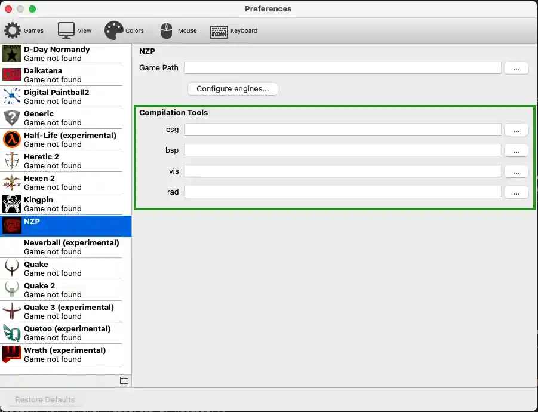

% TrenchBroom Set-Up - NZ:P Mapping Documentation
# TrenchBroom Set-Up

## Introduction

This is a quick-start guide on installing the custom TrenchBroom profile for Nazi Zombies: Portable in order to use its mapping toolset with the program, as well as a brief instructional on installing _Vluzcan's Half-Life Tools_, the `.BSP` compiler to use. Nazi Zombies: Portable relies on _Half-Life_ BSP type `30` as opposed to _Quake_ type `29`. 

This is not a guide on learning to use TrenchBroom or _Quake_ mapping. Please refer to the [Landing page](../landing/index.md#mapping-documentation) for resource links to these.

## TrenchBroom Profile

### Downloading

Nazi Zombies: Portable hosts the TrenchBroom profile on [GitHub](https://github.com/nzp-team/trenchbroom-profile). Navigate to the repository, press the green _Code_ button, followed by pressing _Download ZIP_. The profile will then be downloaded.

### Installation

Once the `.ZIP` archive is downloaded, start TrenchBroom and locate `Preferences`. This will bring you to a panel that displays a list of all currently installed profiles, you will likely only be presented with the default ones available. Click the folder icon (📁) that appears on the bottom of the left window pane to open the `<TrenchBroom>/games` directory in your file manager.

Inside of this directory, create a new one of your choice (`nzp` is likely preferred), and extract the TrenchBroom profile `.ZIP` contents inside of it. You should be left with a similar result to the screenshot showcased above -- an `nzp` directory where the contents contain `Icon.png`, `tb-nzp.fg`, and `GameConfig.cfg`. Installation should now be complete, verify that `NZP` is now present in TrenchBroom `Preferences` to confirm correct installation.

## Compiler Set-Up

### Downloading

The `.BSP` compiler, _Vluzcan's Half-Life Tools_, can be downloaded for x86 and x86_64 variants of Linux and Windows as well as in-support macOS versions via Nazi Zombies: Portable's [GitHub](https://github.com/nzp-team/vhlt/releases/latest) fork. This link, similar to the nightly deployment builds, will always be up to date and are automatically deployed on-commit.

### Installation

Extract and/or copy your VHLT binaries to an easily identifiable location. Navigate to TrenchBroom's `Preferences` menu and select __NZP__ from the list. You will be prompted with four file select dialogues under _Compilation Tools_. Use these dialogues to select the binaries you copied to a directory previously (e.g., link `csg` with `hlcsg.exe`).

Once this is done, the compiler paths can be used in setting up build profiles inside of TrenchBroom, using `${csg}`, `${bsp}`, `${vis}`, and `${rad}`. Reminder that this guide was not made to instruct how to set up basic build profiles for TrenchBroom. Please refer to the [Landing page](../landing/index.md#mapping-documentation) for further resources if necessary.